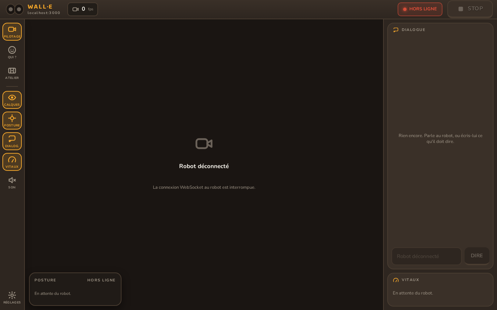
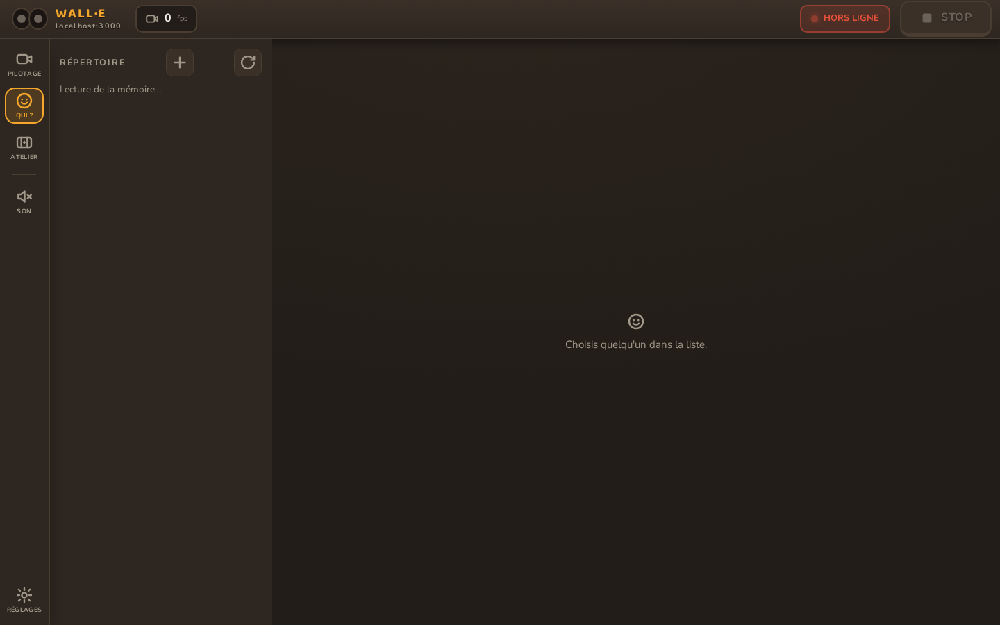
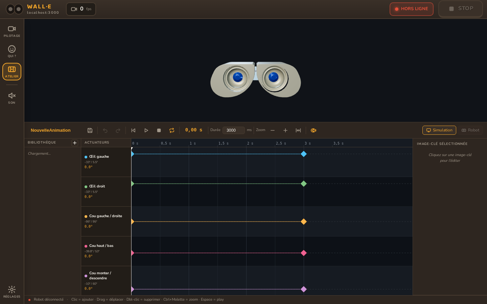
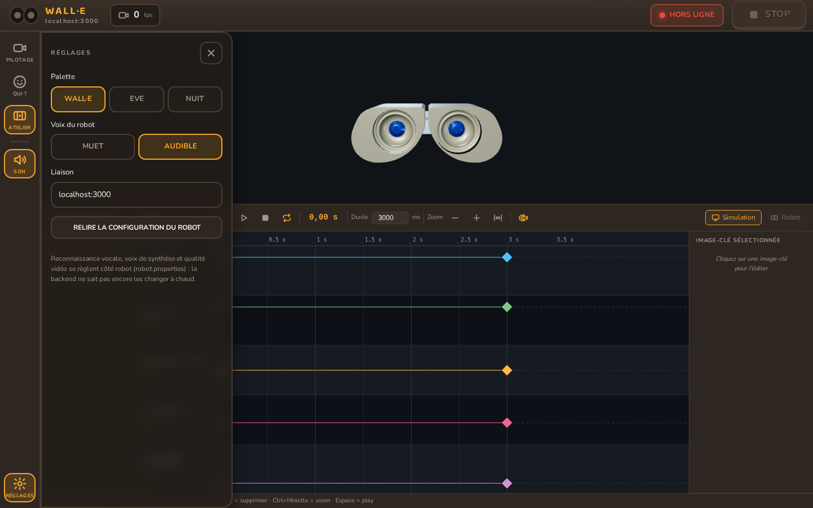

# Application HUD

Le HUD (« Head-Up Display ») est l'écran de contrôle du robot. Une page web, ouverte
sur une tablette ou un ordinateur, connectée au robot en WebSocket.

!!! note "Captures sans robot connecté"
    Ces captures montrent l'application seule, sans robot allumé à côté. C'est pour ça
    qu'on voit « Robot déconnecté » ou « En attente du robot » : une fois connecté, ces
    zones se remplissent avec les vraies données (image de la caméra, position du cou,
    valeurs des capteurs...).

## Vue d'ensemble

<figure markdown="span">
  
  <figcaption>L'écran Pilotage, avec les quatre volets ouverts</figcaption>
</figure>

À gauche, une colonne de boutons. Les trois premiers sont les vrais écrans : **Pilotage**,
**Qui ?**, **Atelier**. En dessous, quatre interrupteurs qui montrent ou cachent des
zones sur l'écran Pilotage — sans rien déconnecter derrière.

## Pilotage

L'écran principal. Une image de caméra au centre, et quatre volets qu'on peut afficher
ou masquer indépendamment :

- **Calques** — les repères dessinés sur l'image (par exemple le visage détecté) ;
- **Posture** — la position actuelle du cou et des yeux, avec des curseurs pour les
  piloter à la main ;
- **Dialog.** — la conversation en cours, et un bouton pour faire parler le robot ;
- **Vitaux** — l'état de chaque organe (une pastille : ça va / ça ne va pas), et les
  jauges de ses capteurs.

Rien de tout ça n'est câblé en dur dans l'application : la liste des organes et de
leurs capteurs vient du robot lui-même (`GET /api/organes`). Un capteur ajouté côté
robot apparaît ici sans qu'il y ait une ligne à écrire côté HUD.

## Qui ?

<figure markdown="span">
  
  <figcaption>Le répertoire des personnes connues du robot</figcaption>
</figure>

Le répertoire du robot : qui il connaît, depuis quand, et ce qu'ils se sont dit. Deux
colonnes — la liste, puis la fiche de la personne choisie — pour comparer deux fiches
ou nettoyer des doublons sans faire d'aller-retour.

## Atelier

<figure markdown="span">
  
  <figcaption>L'éditeur d'animations, avec ses images-clés sur une frise</figcaption>
</figure>

L'éditeur d'animations du robot. En haut, un aperçu 3D des yeux et du cou. En bas, une
frise avec une ligne par axe (œil gauche, œil droit, cou...) et des images-clés qu'on
place, déplace ou supprime à la souris.

Deux façons de tester : **Simulation** (juste à l'écran) ou **Robot** (envoyé pour de
vrai, si un robot est connecté).

## Réglages

<figure markdown="span">
  
  <figcaption>Palette de couleurs, voix du robot, adresse de connexion</figcaption>
</figure>

Trois réglages : la palette de couleurs de l'application (Wall·E, Eve, Nuit), si le
robot doit parler à voix haute ou rester muet, et l'adresse à laquelle se connecter.

La reconnaissance vocale, la voix de synthèse et la qualité vidéo, elles, se règlent
directement sur le robot (`robot.properties`) — le HUD ne peut pas encore les changer
à distance.
