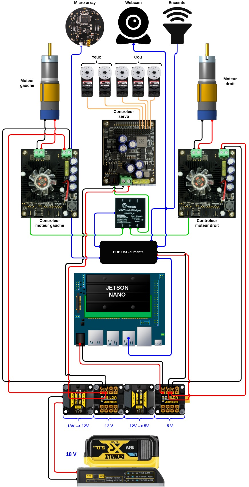

# Matériel

!!! note "Deux points à confirmer"
    - **Hub Phidgets** : le code ne connaît qu'un numéro de série (`561050`), pas le
      modèle exact du hub. J'ai mis la photo du modèle actuel (HUB0002), à confirmer.
    - **goBILDA** : aucune trace dans le code (ce sont des pièces mécaniques, pas
      pilotées individuellement). Dites-moi quelles pièces exactement (roues ? moteurs ?
      châssis ?) pour que j'aille chercher les bonnes photos et fiches produit.

Le cerveau du robot est un **Jetson Nano** (hostname `wall-e` sur le réseau). Tout le
reste — yeux, cou, roues, micro, haut-parleur, caméra — s'y connecte et est piloté
depuis l'application Java.

## Vue d'ensemble

<figure markdown="span">
  
  <figcaption>Schéma électronique du robot</figcaption>
</figure>

## Les organes

- 

    **Jetson Nano**
    Ordinateur embarqué, exécute l'application Java.
    [Page officielle NVIDIA](https://developer.nvidia.com/embedded/jetson-nano)

- 

    **Hub VINT Phidgets** *(modèle exact à confirmer)*
    Pilote les moteurs et lit les capteurs.
    [Page officielle Phidgets](https://www.phidgets.com/?prodid=1289)

| Organe                | Rôle                                            | Référence / lien d'achat |
|------------------------|--------------------------------------------------|---------------------------|
| Cou motorisé           | Oriente la tête (panoramique / inclinaison)      | *à compléter*             |
| Yeux motorisés         | Expriment un regard, bougent indépendamment      | *à compléter*             |
| Roues (traction différentielle) | Permettent au robot de se déplacer, pièces **goBILDA** | *à compléter*   |
| Caméra                 | Détecte et reconnaît les visages                 | *à compléter*             |
| Microphone              | Capte la voix pour la conversation               | *à compléter*             |
| Haut-parleur           | Fait parler le robot                             | *à compléter*             |
| Bouton d'arrêt d'urgence | Coupe le robot immédiatement                    | *à compléter*             |

## Modèles 3D

Le mécanisme des yeux, reconstruit à partir des cotes relevées sur le modèle CAO
(`Wall-E Eye.stl`, trop volumineux pour vivre dans le dépôt) : coques, tringlerie et
butées mécaniques, avec des curseurs pour tester les expressions.

<iframe src="../assets/3d/yeux-walle.html" style="width: 100%; height: 560px; border: 1px solid var(--md-default-fg-color--lightest); border-radius: 4px;"></iframe>
