# Matériel

!!! note "Encore en attente"
    Caméra, haut-parleur et bouton d'arrêt d'urgence : références à venir.

Le cerveau du robot est un **Jetson Nano** (hostname `wall-e` sur le réseau). Tout le
reste — yeux, cou, chenilles, micro, haut-parleur, caméra — s'y connecte et est piloté
depuis l'application Java, via deux cartes Phidgets branchées sur un hub commun. Le
tout est alimenté par une batterie d'outillage, abaissée en 12 V puis 5 V.

## Vue d'ensemble

<figure markdown="span">
  
  <figcaption>Schéma électronique du robot</figcaption>
</figure>

## Les organes

- 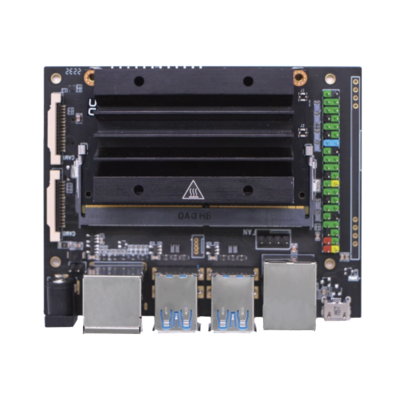

    **Jetson Nano 4 Go**
    Ordinateur embarqué, exécute l'application Java.
    [Kubii](https://www.kubii.com/fr/kits-de-developpement/3882-kit-de-developpement-nvidia-jetson-nano-4gb-3272496313705.html)

- 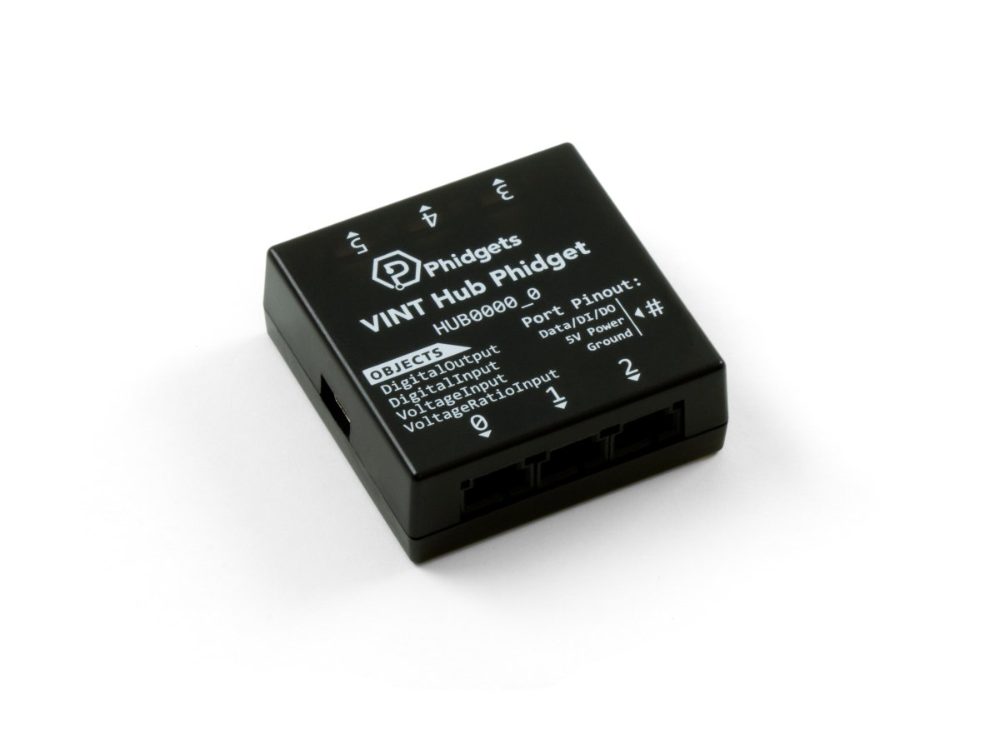

    **Hub VINT Phidgets (HUB0000)**
    Relie toutes les cartes Phidgets à l'USB du Jetson.
    [Phidgets](https://www.phidgets.com/?prodid=643)

- 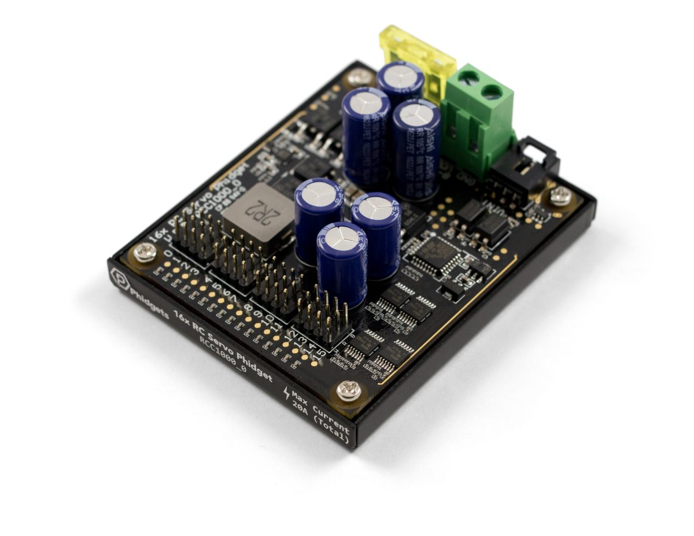

    **16x RC Servo Phidget (RCC1000)**
    Pilote les servomoteurs du cou et des yeux.
    [Phidgets](https://www.phidgets.com/?prodid=1015)

- 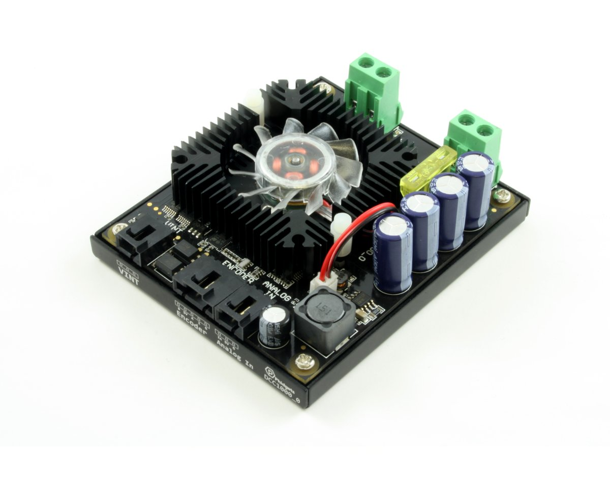

    **DC Motor Phidget (DCC1000) ×2**
    Un par chenille, pour la traction différentielle.
    [Phidgets](https://www.phidgets.com/?prodid=965)

- 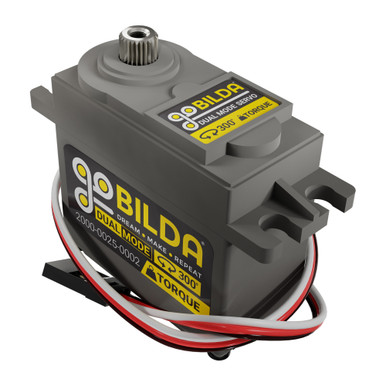

    **Servo goBILDA — 2000 Series Dual Mode**
    300 oz-in, cou et yeux.
    [goBILDA](https://www.gobilda.com/2000-series-dual-mode-servo-25-2-torque/)

- 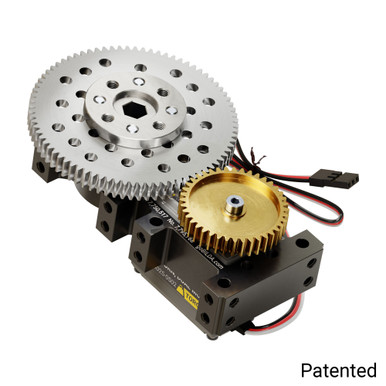

    **Servo goBILDA — Stingray-2**
    700 oz-in, cou et yeux.
    [goBILDA](https://www.gobilda.com/stingray-2-servo-gearbox-0-33-sec-60-30rpm-700-oz-in-torque-900-rotation/)

- 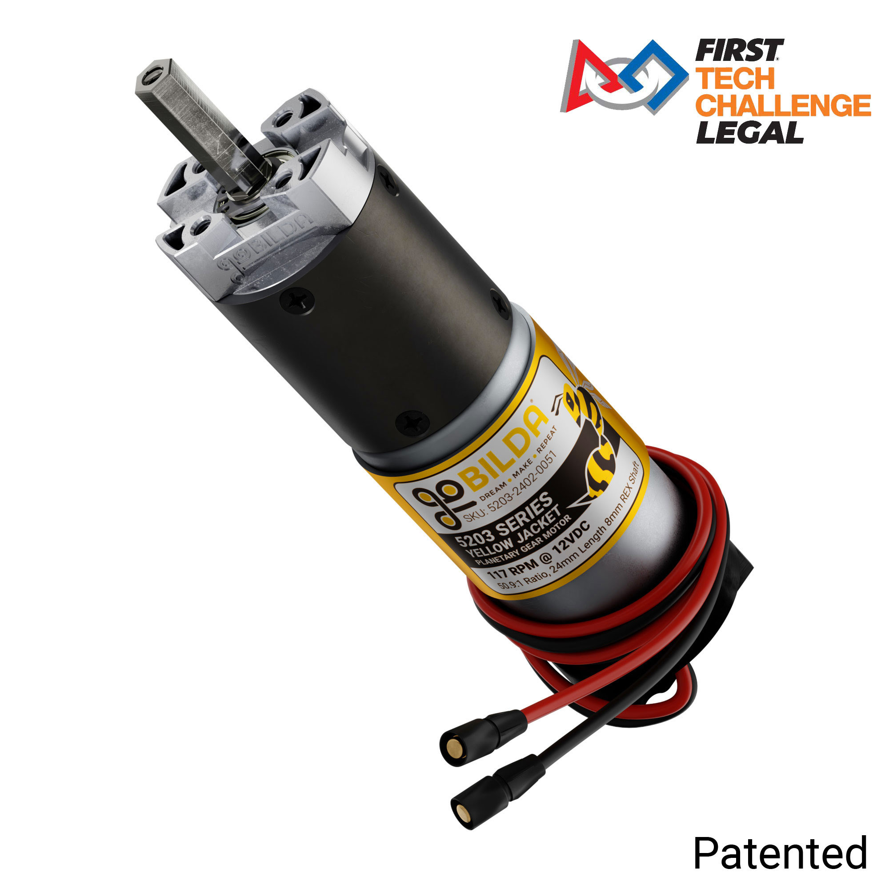

    **Moteur goBILDA — 5203 Yellow Jacket ×2**
    50,9:1, 117 RPM, un par chenille.
    [goBILDA](https://www.gobilda.com/5203-series-yellow-jacket-planetary-gear-motor-50-9-1-ratio-24mm-length-8mm-rex-shaft-117-rpm-3-3-5v-encoder/)

- 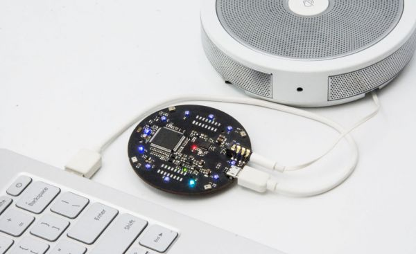

    **ReSpeaker Mic Array v2.0**
    4 micros en cercle, capte la voix à 360° jusqu'à 5 m.
    [Seeed Studio](https://www.seeedstudio.com/ReSpeaker-Mic-Array-v3-0.html)

| Organe                           | Rôle                                             | Piloté par              |
|-----------------------------------|---------------------------------------------------|--------------------------|
| Cou motorisé                     | Oriente la tête (panoramique / inclinaison / hauteur) | Servos goBILDA via RCC1000 |
| Yeux motorisés                   | Expriment un regard, bougent indépendamment       | Servos goBILDA via RCC1000 |
| Chenilles (traction différentielle) | Permettent au robot de se déplacer             | Moteurs goBILDA via 2× DCC1000 |
| Caméra                           | Détecte et reconnaît les visages                  | *à compléter*            |
| Microphone                       | Capte la voix pour la conversation                | ReSpeaker Mic Array v2.0  |
| Haut-parleur                     | Fait parler le robot                              | *à compléter*             |
| Bouton d'arrêt d'urgence         | Coupe le robot immédiatement                       | *à compléter*             |

## Alimentation

Tout part d'une batterie d'outillage 18 V, abaissée en deux étages : 12 V pour les
moteurs, 5 V pour le Jetson Nano et le hub USB.

- 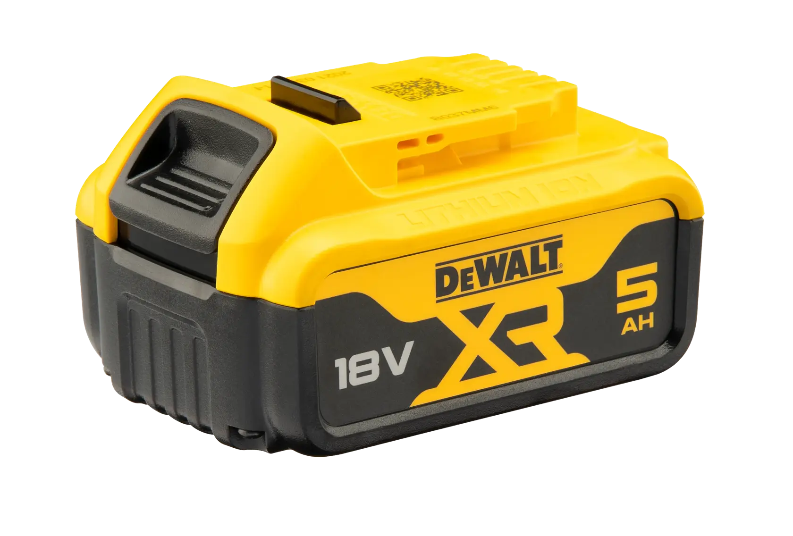

    **Batterie DeWalt 18V XR 5.0 Ah (DCB184)**
    Source d'énergie du robot.
    [DeWalt](https://cee.dewalt.global/product/dcb184-xj/18v-xr-5ah-battery)

- 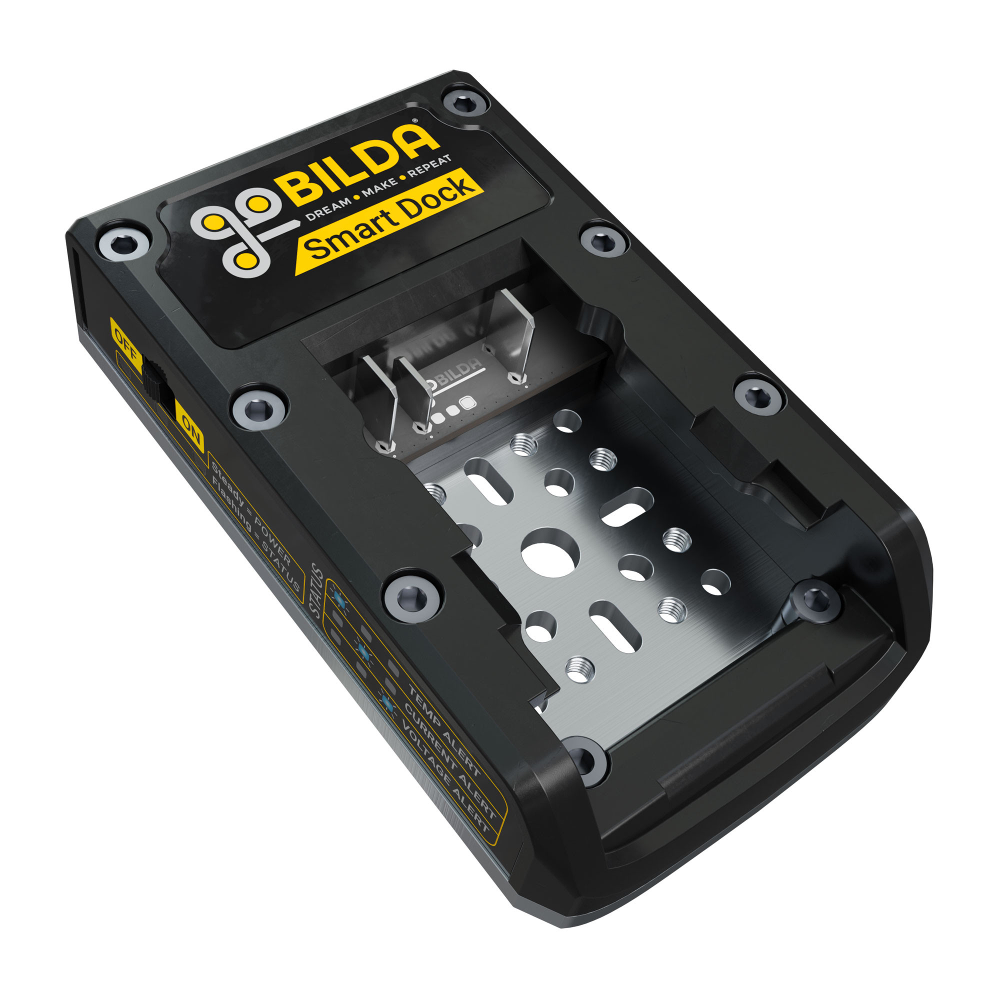

    **goBILDA Smart Dock 20V**
    Reçoit la batterie, protège contre surchauffe/surintensité/sous-tension.
    [goBILDA](https://www.gobilda.com/gobilda-smart-dock-for-20v-battery-dewalt-20v-max-compatible/)

- 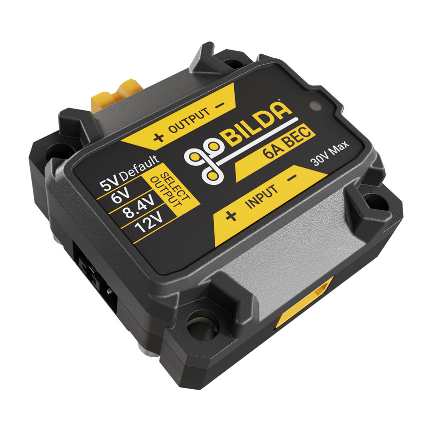

    **goBILDA 6A BEC ×2**
    Abaisse 18 V → 12 V, puis 12 V → 5 V.
    [goBILDA](https://www.gobilda.com/6a-bec-voltage-regulator-6-24v-input-5v-6v-8-4v-12v-output-xt30-connectors-v2/)

- 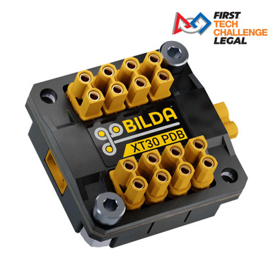

    **goBILDA XT30 PDB ×2**
    Répartit le 12 V puis le 5 V vers chaque organe.
    [goBILDA](https://www.gobilda.com/xt30-power-distribution-board-xt30-input-8-x-xt30-outputs-v1/)

## Modèles 3D

Le mécanisme des yeux, reconstruit à partir des cotes relevées sur le modèle CAO
(`Wall-E Eye.stl`, trop volumineux pour vivre dans le dépôt) : coques, tringlerie et
butées mécaniques, avec des curseurs pour tester les expressions.

<iframe src="../assets/3d/yeux-walle.html" style="width: 100%; height: 560px; border: 1px solid var(--md-default-fg-color--lightest); border-radius: 4px;"></iframe>

## Nomenclature complète

Le châssis, les chenilles et la tourelle sont construits en pièces goBILDA (plaques,
équerres, visserie, axes...). La liste complète — 185 lignes, surtout des références de
catalogue sans intérêt à parcourir une par une — est disponible ici pour qui veut
reproduire le montage :

[:material-file-delimited: Nomenclature (BOM) goBILDA — CSV](../assets/bom-gobilda.csv)
